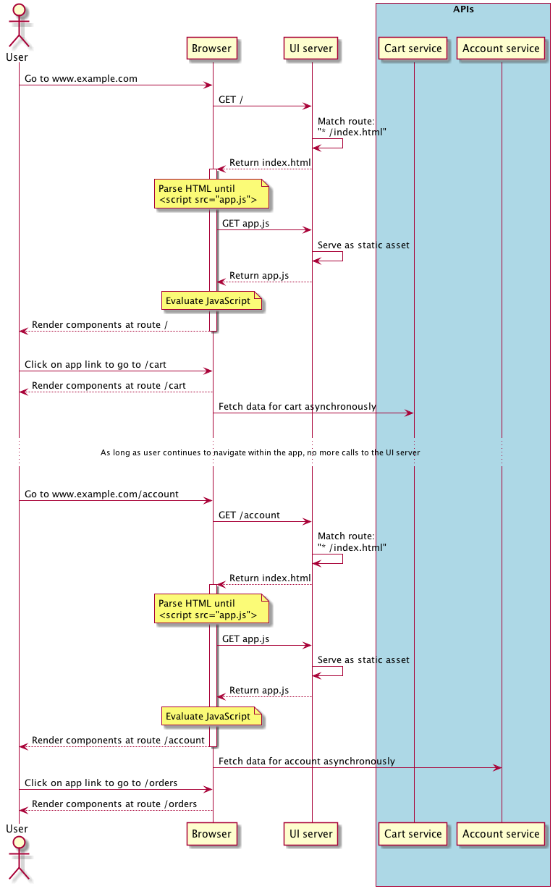

I've noticed some confusion in how Single Page Applications are served among developers who are new
to these apps. This post is a short explanation of how a Single Page Application gets from the web
server to a user's web browser.

<!-- more -->

## First, what is a Single Page Application?

> A Single Page Application (SPA) is a web application or web site that fits on a single web page,
> with the goal of providing a user experience similar to that of a desktop application.

All necessary code – HTML, JavaScript, and CSS – is retrieved with one page load. The page does not
reload at any point, nor does control transfer to another page. As the user navigates around the
application, the URL shown in the browser can be updated to provide the perception and navigability
of separate logical pages in the application, but no more page loads occur unless the user forces
one by clicking the browser's refresh button or by typing a new address into the URL bar and
pressing the \<enter\> key.

## What might this look like?

This is the only HTML file for the entire application, and the only file returned to a client who
requests the application. Both the `app.css` file and the `app.js` file contain all the necessary
CSS and JavaScript that any part of the app needs.

```html
<!-- index.html -->

<!DOCTYPE html>
<html>
<head>
  <title>A single page app</title>

  <link rel="stylesheet" type="text/css" href="app.css" />
</head>
<body>
  <div id="app_root"/>

  <script type="text/css" src="app.js"></script>
</body>
</html>
```

In this example, `app.js` could be a [React](https://facebook.github.io/react/) application that
produces rest of the DOM elements when it is evaluated.

## What about interaction with the web server?

The sequence diagram below shows how and when the front end SPA interacts with the back end web
server.

The UI server below has one and only one job: deliver the single page and all assets that the
application needs when a browser requests them. Therefore, the UI server must be configured as
follows:

* Serve static assets. Handle any request for a static file, such as a JavaScript file, a CSS file,
  an image, or a font file, by loading it from the filesystem and returning it.
* Match all other routes. The UI server uses a "match all" strategy so that any received request
  that does not match a static asset will be handled by returning the single page of the
  application, usually called index.html. This is necessary because the user could force a page load
  while on a specific URL within the application, as shown in the diagram below.



It's important to remember that while the SPA is primarily written in JavaScript, there is no
requirement that necessitates a JavaScript-based UI server. Any web server that is able to handle
the configurations described above will work fine, such as
[Apache](https://access.redhat.com/solutions/67298),
[NGINX](https://www.nginx.com/resources/admin-guide/serving-static-content/), or even
[Amazon S3](https://keita.blog/2015/11/24/hosting-a-single-page-app-on-s3-with-proper-urls/)!
