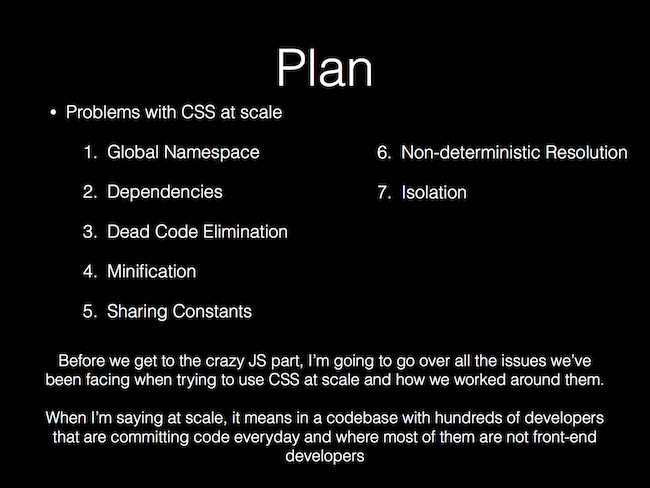
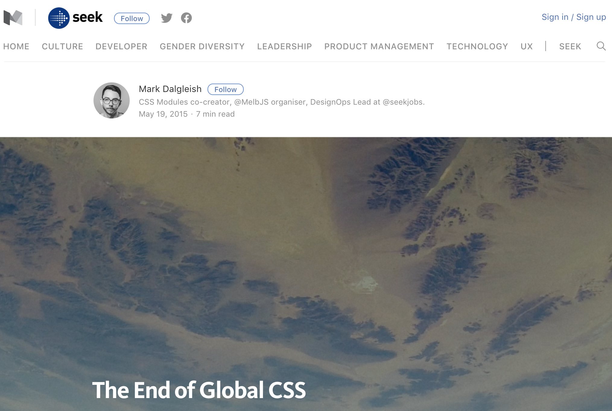
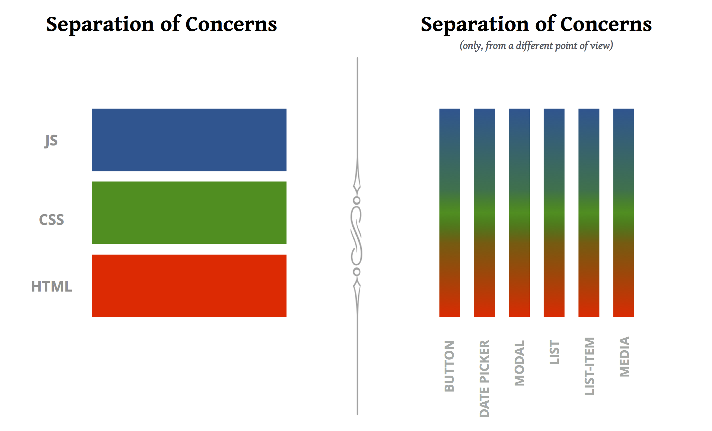
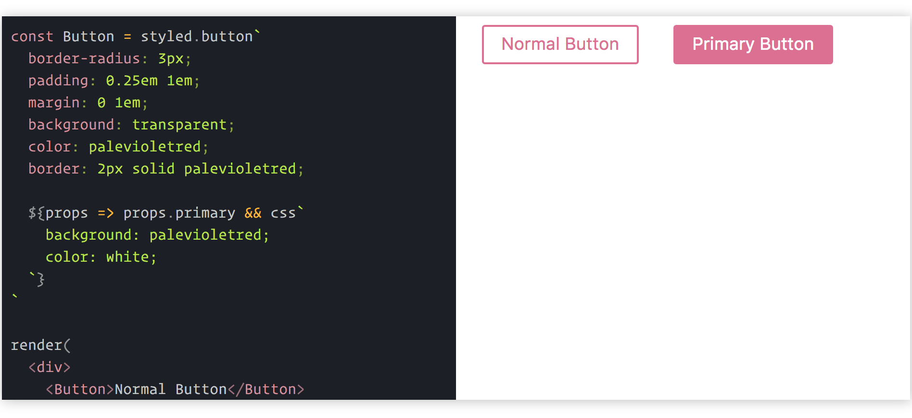

It's no secret that we are currently experiencing a Cambrian explosion of innovation by the
JavaScript community. But what you may not be aware of are the equally evolutionary innovations
under development by the CSS community.

CSS has quietly been improving by leaps and bounds lately. So much so, that you may not even
recognize it much anymore. While you weren't looking, the CSS community has developed real solutions
to many of the oddities, hacks, and deficiencies that made CSS the black sheep of the front end
family in the past.

In this post I'll reveal 5 old-fashioned CSS things that you don't need to do anymore, and what you
should do instead.

1. You don't need a naming convention.
2. You don't need float.
3. You don't need a grid framework.
4. You don't need a preprocessor.
5. **You don't need CSS.**

<!-- more -->

## You don't need naming conventions.

And we begin with the number one problem with CSS, especially at scale: everything is global.

 <small>Source:
https://speakerdeck.com/vjeux/react-css-in-js</small>

Because all selectors exist in the same global namespace, over time it becomes very likely that
you'll run into unexpected side effects such as selectors targeting elements that you didn't intend,
or selectors being overridden by other selectors. So, we have side-stepped these issues with
methodologies ([OOCSS](http://oocss.org/), [SMACSS](https://smacss.com/), or the more popular
[BEM](http://getbem.com/)) that define naming conventions to help us avoid class name collisions.

While we can't discount the importance of these methodologies, they are merely a workaround. They
don't actually solve the problems. We needed something more. And then
[this](https://medium.com/seek-blog/the-end-of-global-css-90d2a4a06284) happened.

 <small>Source:
https://medium.com/seek-blog/the-end-of-global-css-90d2a4a06284</small>

[Mark Dalgleish](https://twitter.com/markdalgleish) and others have since pioneered the concept of
**locally scoped CSS**, which led to the development of
[CSS Modules](https://github.com/css-modules/css-modules), and which has now been incorporated into
modern tooling, most notably webpack's
[css-loader](https://github.com/webpack-contrib/css-loader#modules).

```javascript
// webpack.config.js

{
  test: /\.css$/,
  use: [
    {
      loader: 'css-loader',
      options: {
        modules: true,
        localIdentName: '[path][name]__[local]--[hash:base64:5]'
      }
    }
  ]
}
```

This is huge. When using CSS Modules, name your classes however you like. **At build time, all local
selectors are replaced by unique identifiers, completely removing the need for a global naming
convention.** Check out the docs above for CSS Modules for a deeper dive.

While this technology was born from component-oriented front-end development (think
[React](http://www.reactjs.com)), you can also get support for CSS Modules
[everywhere](https://github.com/css-modules/postcss-modules).

---

## You don't need float.

[Float](https://css-tricks.com/all-about-floats/) has managed to become both the positioning
property of choice and the bane of many a developer's existence by weaseling its way into everything
from [helper classes](http://getbootstrap.com/css/#helper-classes-floats) to
[entire grid systems](https://unsemantic.com/demo-responsive). While occasionally using float to
push an element left or right doesn't get you into too much trouble, pervasive use of it for full
page layouts leads to odd behavior that is a pain to figure out and fix, often requiring hacks.
Pretty soon you find yourself copying the admittedly elegant, yet unintuitive
["clearfix"](https://css-tricks.com/snippets/css/clear-fix/) onto every element and hoping for the
best.

Thankfully, CSS3 introduced a new layout module called flexible boxes, or
[Flexbox](https://www.w3schools.com/css/css3_flexbox.asp) for short. Flexbox is a mostly
1-dimensional layout system that ensures elements behave predictably on various screen sizes and
devices. It also solves the common, yet previously frustrating task of vertical and horizontal
centering. **When you switch to Flexbox, you no longer have any use for float.**

<p data-height="320" data-theme-id="0" data-slug-hash="GmbYjd" data-default-tab="result" data-user="ryanoglesby08" data-embed-version="2" data-pen-title="GmbYjd" class="codepen">See the Pen <a href="https://codepen.io/ryanoglesby08/pen/GmbYjd/">GmbYjd</a> by Ryan Oglesby (<a href="https://codepen.io/ryanoglesby08">@ryanoglesby08</a>) on <a href="https://codepen.io">CodePen</a>.</p>

While Flexbox is [fully supported by all modern browsers](http://caniuse.com/#feat=flexbox), you
will run into issues on older ones. So, if you have to support IE < 10 you will likely still need to
fall back to floats, tables, or some other layout method.

Some browsers also need vendor prefixes, so I recommend using
[Autoprefixer](https://github.com/postcss/autoprefixer) to get the most coverage.

---

## You don't need a grid framework.

Everyone uses a grid. It's a crucial part of every CSS codebase, letting you build complex full-page
layouts by aligning elements along rows and columns. While rolling your own simple grid using
traditional techniques is [fairly straightforward](https://css-tricks.com/dont-overthink-it-grids/),
no one does it. Instead, we reach for one of the many grid frameworks, such as the original
[960gs](https://960.gs/) or the Sass-based [Bourbon Neat](http://neat.bourbon.io/).

Finally, as of March 2017, most browsers added support for the
[CSS Grid Layout](https://css-tricks.com/snippets/css/complete-guide-grid/), a 2-dimensional layout
system built directly into CSS. Since most traditional grid frameworks still rely on float, CSS Grid
is an attractive alternative. CSS Grid makes it easy to define your own grid without the help of a
framework by providing an intuitive interface for defining the number and sizes of rows and columns,
the gutter spacing, alignment of elements within the grid, named areas, and more.

<p data-height="253" data-theme-id="0" data-slug-hash="pwzNdB" data-default-tab="css" data-user="ryanoglesby08" data-embed-version="2" data-pen-title="pwzNdB" class="codepen">See the Pen <a href="https://codepen.io/ryanoglesby08/pen/pwzNdB/">pwzNdB</a> by Ryan Oglesby (<a href="https://codepen.io/ryanoglesby08">@ryanoglesby08</a>) on <a href="https://codepen.io">CodePen</a>.</p>

[At the time of writing this article](http://caniuse.com/#feat=css-grid), CSS Grid is supported by
all modern browsers, with partial support on IE if you use vendor prefixes (use
[Autoprefixer](https://github.com/postcss/autoprefixer)).

---

## You don't need a preprocessor.

Undeniably, CSS language extensions such as [Sass](http://sass-lang.com/) and
[Less](http://lesscss.org/) brought game-changing features to CSS, including data reuse with
variables, better organization with nesting, and property reuse with mixins. But, these languages
didn't change anything about the core language of CSS; they added a layer of abstraction on top of
it. In the case of Sass, you also need an [additional binary](http://sass-lang.com/libsass) to
compile the Sass files into CSS. When using one of these preprocessors, you now have to learn CSS
_and_ the preprocessor specific syntax.

But, while most developers were blissfully coupling to their preprocessors, CSS was quietly
progressing. Modern browsers now have native support for
[CSS variables](https://www.w3.org/TR/css-variables/) and
[calc()](https://www.w3.org/TR/css3-values/#calc). Other features such as
[color modifications](https://drafts.csswg.org/css-color/#modifying-colors), and
[mixins](http://tabatkins.github.io/specs/css-apply-rule/) are not far behind.

```css
:root {
  --spacing: 1.5em; /* declaring a variable */
  /* declaring a mixin */
  --base-colors: {
    color: #fff;
    background-color: color(#fff shade(+80%)); /* modifying a color */
  }
}

.some-class {
  padding: var(--spacing);
  width: calc(100% - var(--spacing)); /* dynamically calculating a value */
  @apply --base-colors;
}
```

Fortunately for CSS, the JavaScript community has already had the problem of browsers not supporting
new features fast enough, which led to [Babel](https://babeljs.io/), giving JavaScript developers
everywhere access to "next generation JavaScript, today." Similarly, [PostCSS](http://postcss.org/)
is a "tool for transforming CSS with JavaScript", which gets its power from the extensive list of
community maintained [plugins](https://github.com/postcss/postcss/blob/master/docs/plugins.md). CSS
developers can even "use tomorrow's CSS syntax, today" with the [cssnext](http://cssnext.io/)
PostCSS plugin.

**Writing plain CSS and transforming it with PostCSS plugins produces more future-proof CSS with
less cognitive and technical overhead than old preprocessors.**

---

## You don't need CSS.

Ok, so that's not entirely true. While CSS remains the only document styling language that browsers
understand, **you can style web applications without ever writing a single .css file**. With the
help of UI libraries such as React or Vue.js, modern web application architecture has embraced
loosely coupled, highly cohesive components that often co-locate HTML, CSS, and JavaScript in the
same file. Interestingly, this idea is in direct contradiction to previously held best practices
around separation of these concerns.
([This conference talk](https://www.youtube.com/watch?v=x7cQ3mrcKaY), called "Rethinking best
practices" gives a great explanation.)

 <small>Source:
https://speakerdeck.com/didoo/let-there-be-peace-on-css</small>

From a CSS perspective, this rethinking has even been given a catchy name:
[CSS-in-JS](https://speakerdeck.com/vjeux/react-css-in-js).

At first, CSS-in-JS libraries used the HTML "style" attribute to attach styles onto elements, a
flawed approach because the "style" attribute can't do everything CSS can do. Now, most libraries
generate real style sheets with the full power of CSS, eschewing use of the "style" attribute for
the most part.

Writing CSS using JavaScript addresses most of the other points I've brought up in this article.
Most new libraries scope styles automatically, make reuse of classes easy and efficient, identify
and inline critical-path CSS for faster initial load times, and enable real modular sharing of
open-source CSS packages.
[This must-read article](https://medium.com/seek-blog/a-unified-styling-language-d0c208de2660)
outlines the architectural benefits for CSS-in-JS and is the best I've read so far.

As this space is new and exciting, there has been an
[explosion of libraries](https://github.com/MicheleBertoli/css-in-js) (this list is even slightly
old now). This is a good thing. It will take some time to settle down as the community discovers
best practices, such as avoidance of the "style" attribute, proper support for media queries, and
the ability to use proper CSS syntax instead of a JavaScript object.

[JSS](http://cssinjs.org/) is a very popular choice, with an active community and a stable
interface; but I'm especially excited about the direction of
[styled-components](https://www.styled-components.com/), which cleverly attaches CSS to components
via
[tagged template literals](https://www.styled-components.com/docs/advanced#tagged-template-literals).

 <small>Source:
https://www.styled-components.com</small>

---

## CSS is dead. Long Live CSS.

* You don't need naming conventions because _locally-scoped styles by default are now baked-in to
  libraries_.
* You don't need float because _Flexbox is more powerful and less hacky_.
* You don't need a grid framework because _there's one built into CSS_.
* You don't need a preprocessor because _CSS has more advanced features now_.
* You don't need CSS because _writing styles in JavaScript enables more architectural and community
  benefits_.

I'm excited about the large-scale adoption of modern JavaScript techniques and UI libraries,
especially React. But, I'm frustrated at the same time because those same codebases continue using
dated, flawed CSS techniques and technologies instead of embracing modernity. It's time we recognize
the importance of these new developments in the CSS community and find a way out of our old,
comfortable habits.
